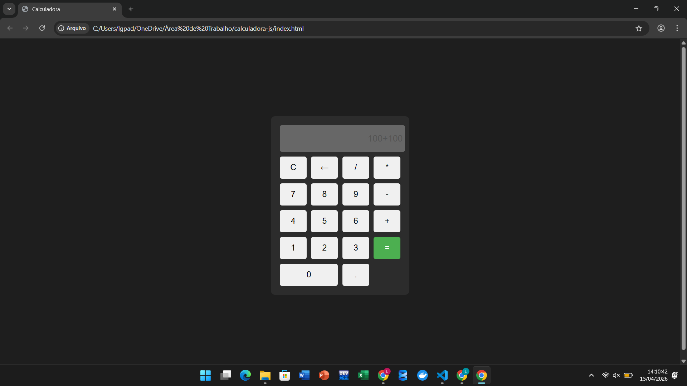

# 🧮 Calculadora Web

  

Uma calculadora simples desenvolvida com HTML, CSS e JavaScript.

---

## 🚀 Funcionalidades

- Soma
- Subtração
- Multiplicação
- Divisão
- Limpar e apagar valores

---

## 🛠️ Tecnologias

- HTML
- CSS
- JavaScript

---

## ▶️ Como executar

1. Baixe o projeto
2. Abra o arquivo `index.html` no navegador

---

## 📌 Autor

Luís Padilha
